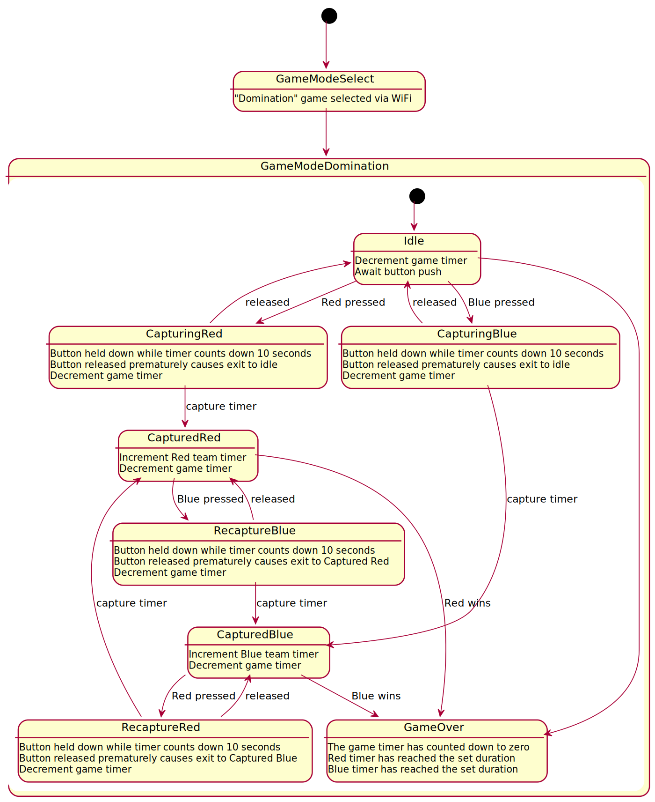

# Domination Game Mode

### Options:

* **Game timer** - how long is the total game play for? (team with most time at the end wins)
* **Team timer** - game play continues until one team reaches a set amount of time on their timer.
* **Capture timer** - how long must a button be pressed before the team is awarded control?
* **Constantly pressed** - determines if the team's button needs to be constantly pressed to increment their team counter

### State Diagram:

