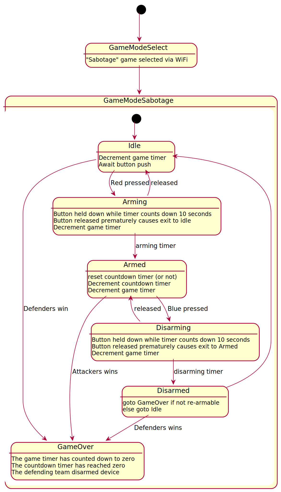

# Sabotage Game Mode

All usage granted under 
[Creative Commons Attribution-ShareAlike 4.0 International License](http://creativecommons.org/licenses/by-sa/4.0/)

## Options

* **Game timer** - how long is the total game play for? (how long is game prop active)
* **Countdown timer** - countdown on prop until detonation.
* **Reset Countdown timer** - determines if the countdown timer is reset when team possession changes.
* **Capture timer** - how long must a button be pressed before the team is awarded control of the prop? (default 10 seconds)
* **Re-armable** - can the prop be replanted once it has been disarmed?

## State Diagram:

